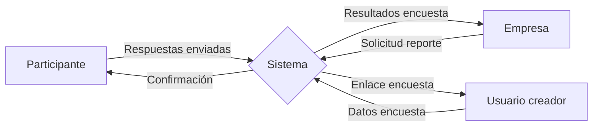
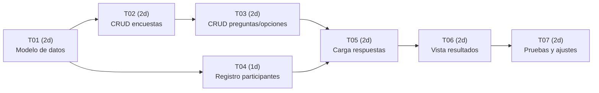
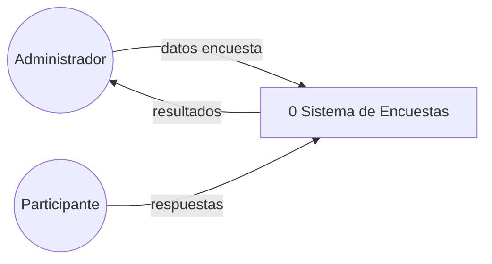

# Caso deNegocio

***Proceso actual y problemas a resolver:***

Las organizaciones necesitan recolectar información sobre las opiniones de sus clientes, empleados o usuarios respecto de productos, servicios o experiencias. Para ello, pueden utilizar encuestas en las que se recopilan las respuestas de los participantes.

Cuando las encuestas incluyen preguntas abiertas, las respuestas pueden ser subjetivas y presentar diferentes formas de expresar una misma opinión, lo que dificulta su comparación y análisis. Esto requiere posteriormente organizar e interpretar la información para poder identificar tendencias, niveles de satisfacción o preferencias.

Por este motivo, surge la necesidad de contar con un proceso de recolección más estructurado, en el que las preguntas tengan opciones de respuesta predefinidas, permitiendo obtener datos homogéneos, comparables y más fáciles de analizar.

El sistema propuesto responde a la necesidad de las organizaciones de recolectar opiniones de manera estructurada, consistente y fácilmente analizable. A diferencia de las encuestas con preguntas abiertas, donde las respuestas son subjetivas y difíciles de comparar, este sistema se basa exclusivamente en preguntas con opciones predefinidas.

-   **¿Por qué estamos realizando este proyecto?** Porque las organizaciones necesitan conocer la opinión de sus clientes, empleados o usuarios sobre productos, servicios o experiencias, pero requieren datos cuantificables y comparables, no interpretaciones subjetivas.

-   **¿De qué se trata el proyecto?** Es un sistema que permite crear encuestas con preguntas de opción múltiple, donde los participantes eligen entre opciones predefinidas, y las respuestas se almacenan de forma estructurada para su posterior análisis estadístico.

-   **¿De qué manera esta solución aborda los problemas de negocios importantes?** Elimina la ambigüedad de las respuestas abiertas, garantiza que todos los participantes respondan bajo las mismas condiciones, y permite generar reportes claros sobre tendencias, niveles de satisfacción y preferencias.

-   **¿Cuánto costará y cuánto tiempo llevará?** El costo es bajo en comparación con sistemas complejos, ya que la lógica es sencilla. El tiempo estimado de desarrollo es de 8 a 12 semanas para una versión funcional básica.

-   **¿Se sufrirá alguna pérdida de productividad durante la transición?** No, porque es un sistema nuevo que no reemplaza a ningún sistema existente; simplemente se incorpora como una nueva herramienta.

-   **¿Cuál es el periodo de retorno de inversión y pago?** El retorno es inmediato en términos de mejora en la toma de decisiones, ya que los datos recolectados permiten a la gerencia actuar con información objetiva.

-   **¿Cuáles son los riesgos en llevar a cabo el proyecto?** Riesgo bajo. El principal riesgo es que las preguntas están mal diseñadas, lo que llevaría a datos poco útiles. También existe el riesgo de baja participación si la encuesta no es atractiva o fácil de usar.

-   **¿Cuáles son los riesgos de no hacerlo?** La organización seguiría tomando decisiones sin información objetiva, basándose en suposiciones o en comentarios aislados que no representan a la mayoría.

-   **¿Cómo se medirá el éxito?** Por el número de encuestas completadas, la consistencia de los datos recolectados y la utilidad de los reportes generados para la toma de decisiones.

-   **¿Qué alternativas existen?** Se podría utilizar una herramienta comercial como Google Forms, SurveyMonkey o Typeform, pero el desarrollo interno permite mayor control sobre los datos, personalización según necesidades específicas e integración con otros sistemas internos.

***Análisis FODA***

**Fortalezas:**

-   Simplicidad del modelo: las preguntas cerradas son fáciles de entender y responder.

-   Datos consistentes: todas las respuestas son comparables entre sí.

-   Facilidad de análisis: los datos se pueden procesar automáticamente sin interpretación humana.

-   Bajo costo de desarrollo y mantenimiento.

-   Escalable: puede crecer para soportar miles de respuestas.

**Oportunidades:**

-   Aplicable a múltiples industrias: salud, educación, retail, gobierno, servicios.

-   Posible integración con sistemas de CRM, ERP o herramientas de business intelligence.

-   Expansión a análisis avanzados: segmentación por grupos demográficos, correlaciones entre preguntas.

**Debilidades:**

-   No permite capturar matices o respuestas no previstas por el diseñador de la encuesta.

-   Depende completamente de la calidad del diseño de las opciones de respuesta.

-   Puede generar frustración si el participante no encuentra una opción que se ajuste a su opinión.

**Amenazas:**

-   Competencia con herramientas gratuitas y ampliamente disponibles como Google Forms.

-   Cambios en regulaciones de privacidad (GDPR, CCPA, etc.) que afecten la recolección y almacenamiento de datos personales.

-   Baja participación si la experiencia de usuario no es fluida.

***Factibilidad***

**Factibilidad Operacional:\
** Alta. El concepto de encuestas con opciones es familiar para la mayoría de las personas. Tanto los creadores como los participantes entenderán rápidamente cómo usar el sistema.

**Factibilidad Económica:\
** Alta. El desarrollo es sencillo y los costos de infraestructura son bajos (un servidor web y una base de datos). Los beneficios incluyen mejor toma de decisiones, mayor satisfacción del cliente y detección temprana de problemas.

**Factibilidad Técnica\
** Alta. Se puede implementar con tecnologías web estándar y bases de datos relacionales, con las cuales el equipo de desarrollo está familiarizado.

**Factibilidad de Cronograma\
** Alta. El alcance está claramente definido y no requiere investigaciones complejas ni tecnologías experimentales.

***Alcance del sistema***

El sistema tendrá como alcance la creación, gestión y publicación de encuestas basadas exclusivamente en preguntas con opciones de respuesta predefinidas.

Dentro del alcance se incluye:

# Creación, edición, publicación y cierre de encuestas.

# Creación y gestión de preguntas y opciones de respuesta.

# Acceso de los participantes a las encuestas activas.

# Registro y almacenamiento de las respuestas.

# Validación de las respuestas antes del envío.

# Generación de reportes con los resultados de las encuestas.

# Gestión de usuarios administradores y participantes.

# Fuera del alcance inicial quedan las preguntas de respuesta abierta, el análisis avanzado mediante inteligencia artificial y las integraciones con sistemas externos como CRM o ERP.

# ***Requerimientos del Sistema***

**Requerimientos Funcionales:**

1.  **Gestión de encuestas**: El sistema debe permitir a los administradores crear, editar, publicar y cerrar encuestas. Cada encuesta debe tener un título, una descripción opcional y un estado (activa, cerrada, en borrador).

2.  **Gestión de preguntas**: Cada encuesta puede contener una o más preguntas.

3.  **Gestión de opciones**: Cada pregunta debe tener al menos dos opciones de respuesta predefinidas y un orden.

4.  **Participación en encuestas**: Los participantes deben poder acceder a las encuestas activas, leer las preguntas y seleccionar una opción. No se permite texto libre.

5.  **Registro de respuestas**: Cada respuesta debe quedar registrada en el sistema, asociada a la encuesta, a la pregunta y a la opción seleccionada.

6.  **Generación de reportes**: El sistema debe permitir visualizar los resultados de una encuesta cerrada, mostrando la distribución de respuestas para cada pregunta, ya sea en forma numérica (conteo, porcentajes) o gráfica.

**Requerimientos No Funcionales:**

1.  **Escalabilidad**: El sistema debe poder manejar un crecimiento en el número de encuestas y respuestas, sin degradación significativa del rendimiento.

2.  **Seguridad**: Los datos recolectados deben estar protegidos contra accesos no autorizados. Si se recolectan datos personales (nombre, email, etc.), deben cumplirse las regulaciones de privacidad aplicables.

3.  **Disponibilidad**: El sistema debe estar accesible para los participantes en todo momento

4.  **Usabilidad**: La interfaz para los participantes debe ser clara, simple y rápida. La interfaz para los administradores debe permitir una creación ágil de encuestas.

***Actores del sistema***

**Administrador:** Es el usuario encargado de gestionar las encuestas. Puede crear, editar, publicar y cerrar encuestas, administrar sus preguntas y opciones, y consultar los resultados y reportes.

**Participante:** Es el usuario que accede a una encuesta activa, responde las preguntas seleccionando las opciones disponibles y envía sus respuestas.

**Sistema:** Se encarga de validar las operaciones, almacenar las respuestas y generar los resultados y reportes correspondientes.

***Diccionario de Datos***

**Tabla ENCUESTA**

-   **id**: Identificador único de la encuesta (clave primaria, autoincremental).

-   **titulo**: Título breve de la encuesta (texto, hasta 200 caracteres).

-   **fecha_creacion**: Fecha y hora de creación (timestamp).

-   **estado**: Estado de la encuesta (activa o inactiva)

**Tabla PREGUNTA**

-   **id**: Identificador único de la pregunta (clave primaria, autoincremental).

-   **encuesta_id**: Identificador de la encuesta a la que pertenece (clave foránea).

**Tabla OPCION**

-   **id**: Identificador único de la opción (clave primaria, autoincremental).

-   **pregunta_id**: Identificador de la pregunta a la que pertenece (clave foránea).

**Tabla RESPUESTA**

-   **id**: Identificador único de la respuesta (clave primaria, autoincremental).

-   **encuesta_id**: Identificador de la encuesta respondida (clave foránea).

-   **participante_id**: Identificador del participante (clave foránea, opcional).

-   **fecha**: Fecha y hora en que se registró la respuesta (timestamp).

**Tabla DETALLE_RESPUESTA**

-   **respuesta_id**: identificador de la respuesta (clave foránea).

-   **pregunta_id**: Identificador de la pregunta respondida (clave foránea).

-   **opcion_id**: Identificador de la opción seleccionada (clave foránea).

# ***Diagrama de Flujos de Datos***

# ***Reglas de Negocio***

1.  Una encuesta debe tener al menos una pregunta.

2.  Cada pregunta debe tener al menos dos opciones de respuesta.

3.  No se permiten opciones de respuesta duplicadas dentro de una misma pregunta.

4.  Una encuesta solo puede ser respondida si está en estado \"activa\".

5.  Un participante no puede responder más de una vez a la misma encuesta.

6.  El participante solo puede elegir una opción.

7.  El sistema debe validar que todas las preguntas sean respondidas antes de permitir el envío de la encuesta.

***Historias de Usuario y Criterios de Aceptación***

**HU-01: Crear una encuesta**

**Como** administrador, **quiero** crear una nueva encuesta con un título, una descripción y preguntas con opciones de respuesta, **para** poder publicarla y obtener respuestas de los participantes.

**Criterios de aceptación:**

-   El administrador debe poder ingresar un título para la encuesta.

-   El administrador puede ingresar una descripción opcional.

-   La encuesta debe tener al menos una pregunta.

-   Cada pregunta debe tener al menos dos opciones de respuesta.

-   No se deben permitir opciones de respuesta duplicadas dentro de una misma pregunta.

-   La encuesta debe poder guardarse en estado borrador.

**HU-02: Publicar una encuesta**

**Como** administrador, **quiero** publicar una encuesta creada, **para** permitir que los participantes puedan responderla.

**Criterios de aceptación:**

-   El administrador debe poder publicar una encuesta que tenga al menos una pregunta.

-   Todas las preguntas deben tener al menos dos opciones de respuesta.

-   La encuesta debe cambiar su estado a \"activa\".

-   El sistema debe generar un enlace para acceder a la encuesta.

**HU-03: Responder una encuesta**

**Como** participante, **quiero** acceder a una encuesta activa y seleccionar una opción para cada pregunta, **para** registrar mis respuestas.

**Criterios de aceptación:**

-   El participante debe poder acceder a una encuesta que se encuentre activa.

-   El sistema debe mostrar todas las preguntas y sus opciones de respuesta.

-   El participante debe poder seleccionar una sola opción por pregunta.

-   No se debe permitir el ingreso de texto libre.

-   Todas las preguntas deben ser respondidas antes de enviar la encuesta.

-   Un participante no puede responder más de una vez la misma encuesta.

**HU-04: Registrar las respuestas**

**Como** sistema, **quiero** almacenar las respuestas seleccionadas por el participante,\
**para** conservar la información y permitir su posterior análisis.

**Criterios de aceptación:**

-   El sistema debe registrar cada respuesta asociándola a la encuesta correspondiente.

-   Cada respuesta debe quedar asociada a la pregunta correspondiente.

-   Cada respuesta debe identificar la opción seleccionada.

-   El sistema debe confirmar al participante que la encuesta fue completada correctamente.

**HU-05: Cerrar una encuesta**

**Como** administrador, **quiero** cerrar una encuesta activa, **para** impedir que se sigan registrando nuevas respuestas.

**Criterios de aceptación:**

-   El administrador debe poder cerrar una encuesta activa.

-   La encuesta debe cambiar su estado a \"cerrada\".

-   Una encuesta cerrada no debe permitir el registro de nuevas respuestas.

**HU-06: Consultar resultados**

**Como** administrador, **quiero** consultar los resultados de una encuesta cerrada,\
**para** analizar las respuestas obtenidas y conocer tendencias y preferencias.

**Criterios de aceptación:**

-   El administrador debe poder seleccionar una encuesta cerrada.

-   El sistema debe mostrar la cantidad total de respuestas.

-   El sistema debe mostrar la cantidad de veces que fue seleccionada cada opción.

-   El sistema debe calcular el porcentaje correspondiente a cada opción.

-   Los resultados deben poder visualizarse en formato tabular y/o gráfico.

## ***Escenarios Gherkin***

### HU-01: Crear una encuesta

Característica: Crear una encuesta

Escenario: Crear una encuesta correctamente

Dado que el administrador se encuentra en la opción \"Crear nueva encuesta\"

Cuando ingresa el título y agrega al menos una pregunta con dos opciones de respuesta

Y guarda la encuesta

Entonces el sistema debe crear la encuesta

Y debe quedar en estado \"borrador\"

Escenario: Crear una encuesta sin preguntas

Dado que el administrador se encuentra creando una encuesta

Cuando intenta guardar la encuesta sin agregar preguntas

Entonces el sistema debe informar que la encuesta debe tener al menos una pregunta

Escenario: Crear una pregunta con menos de dos opciones

Dado que el administrador está creando una pregunta

Cuando intenta guardarla con menos de dos opciones de respuesta

Entonces el sistema debe informar que cada pregunta debe tener al menos dos opciones

### HU-02: Publicar una encuesta

Característica: Publicar una encuesta

Escenario: Publicar una encuesta correctamente

Dado que existe una encuesta en estado \"borrador\"

Y la encuesta tiene al menos una pregunta

Y cada pregunta tiene al menos dos opciones

Cuando el administrador selecciona la opción \"Publicar\"

Entonces el sistema debe cambiar el estado de la encuesta a \"activa\"

Y debe generar un enlace para acceder a la encuesta

### HU-03: Responder una encuesta

Característica: Responder una encuesta

Escenario: Responder una encuesta correctamente

Dado que existe una encuesta en estado \"activa\"

Y el participante accede al enlace de la encuesta

Cuando selecciona una opción para cada pregunta

Y confirma el envío de las respuestas

Entonces el sistema debe registrar las respuestas

Y debe mostrar un mensaje de confirmación

Escenario: Intentar responder una encuesta cerrada

Dado que existe una encuesta en estado \"cerrada\"

Cuando el participante intenta responderla

Entonces el sistema no debe permitir registrar respuestas

Escenario: Enviar una encuesta sin responder todas las preguntas

Dado que el participante se encuentra respondiendo una encuesta activa

Cuando intenta enviar la encuesta sin responder todas las preguntas

Entonces el sistema debe informar que todas las preguntas deben ser respondidas

Escenario: Responder una encuesta más de una vez

Dado que el participante ya respondió una encuesta

Cuando intenta responder nuevamente la misma encuesta

Entonces el sistema no debe permitir una segunda respuesta

### HU-04: Registrar las respuestas

Característica: Registrar respuestas

Escenario: Registrar las respuestas de una encuesta

Dado que el participante completó todas las preguntas de una encuesta activa

Cuando confirma el envío

Entonces el sistema debe almacenar las respuestas

Y cada respuesta debe quedar asociada a la encuesta, pregunta y opción seleccionada

### HU-05: Cerrar una encuesta

Característica: Cerrar una encuesta

Escenario: Cerrar una encuesta activa

Dado que existe una encuesta en estado \"activa\"

Cuando el administrador selecciona la opción \"Cerrar\"

Entonces el sistema debe cambiar el estado de la encuesta a \"cerrada\"

Y no debe permitir registrar nuevas respuestas

### HU-06: Consultar resultados

Característica: Consultar resultados

Escenario: Consultar los resultados de una encuesta cerrada

Dado que existe una encuesta en estado \"cerrada\"

Y la encuesta tiene respuestas registradas

Cuando el administrador solicita consultar los resultados

Entonces el sistema debe mostrar la cantidad total de respuestas

Y debe mostrar la cantidad de veces que fue seleccionada cada opción

Y debe mostrar el porcentaje correspondiente a cada opción

Y debe presentar los resultados en formato tabular y/o gráfico

**Validación de los escenarios**

Los escenarios Gherkin serán revisados por el equipo de desarrollo para verificar que sean claros, completos y coherentes con las historias de usuario, los requerimientos y las reglas de negocio definidas.

Una vez realizada esta revisión interna, los escenarios serán presentados para su validación. Se tendrán en cuenta sus observaciones y se realizarán los ajustes necesarios para asegurar que los escenarios representen correctamente el comportamiento esperado del sistema.

La validación tendrá como objetivo comprobar que:

-   Cada escenario corresponda a una funcionalidad definida.

-   Las condiciones iniciales estén claramente especificadas.

-   Las acciones del usuario estén correctamente descritas.

-   Los resultados esperados sean claros y verificables.

-   Los escenarios contemplen tanto los casos correctos como las situaciones de error.

## ***API REST básica***

La API REST permitirá que la aplicación web se comunique con el servidor para gestionar las encuestas, preguntas, respuestas y resultados.

  -------------------------------------------------------------------------------------------------
  **Endpoint**                     **Verbo HTTP**   **Descripción**
  -------------------------------- ---------------- -----------------------------------------------
  /api/encuestas                   GET              Obtener las encuestas disponibles.

  /api/encuestas                   POST             Crear una nueva encuesta.

  /api/encuestas/{id}              GET              Obtener los datos de una encuesta específica.

  /api/encuestas/{id}              PUT              Modificar una encuesta existente.

  /api/encuestas/{id}              DELETE           Eliminar una encuesta.

  /api/encuestas/{id}/publicar     PUT              Publicar una encuesta.

  /api/encuestas/{id}/cerrar       PUT              Cerrar una encuesta.

  /api/encuestas/{id}/preguntas    POST             Agregar una pregunta a una encuesta.

  /api/encuestas/{id}/respuestas   POST             Registrar las respuestas de un participante.

  /api/encuestas/{id}/resultados   GET              Consultar los resultados de una encuesta.
  -------------------------------------------------------------------------------------------------

Los endpoints propuestos representan las operaciones principales necesarias para el funcionamiento del sistema. La implementación definitiva podrá ajustarse durante la etapa de desarrollo según las necesidades del proyecto.

# ***Modelado de Procesos***

**Proceso: Creación de una encuesta**

1.  Selecciona la opción \"Crear nueva encuesta\".

2.  Ingresa el título y la descripción de la encuesta.

3.  Agrega preguntas una por una:

    -   Ingresa el texto de la pregunta.

    -   Agrega las opciones de respuesta (mínimo 2).

4.  Publicar la encuesta

5.  El sistema genera un enlace único para compartir con los participantes.

**Proceso: Participación en una encuesta**

1.  El participante accede al enlace de la encuesta.

2.  El sistema muestra la encuesta con todas sus preguntas y opciones.

3.  El participante lee cada pregunta y selecciona una opción.

4.  El participante confirma el envío de sus respuestas.

5.  El sistema almacena las respuestas en la base de datos.

6.  El sistema confirma que la encuesta ha sido completada exitosamente.

**Proceso: Generación de reportes**

1.  El administrador selecciona una encuesta que ya haya sido cerrada.

2.  El sistema consulta todas las respuestas almacenadas para esa encuesta.

3.  Para cada pregunta, el sistema calcula:

    -   Cantidad total de respuestas.

    -   Cantidad de veces que se seleccionó cada opción.

    -   Porcentaje que representa cada opción sobre el total.

4.  El sistema presenta los resultados en formato tabular y/o gráfico.

# **Diseño de Interfaz de Usuario**

**Pantalla de creación de encuesta:**

El administrador ve un formulario donde puede ingresar el título y la descripción de la encuesta. Luego, un área donde puede agregar preguntas dinámicamente. Para cada pregunta, debe escribir el texto agregar las opciones de respuesta

**Pantalla de respuesta para el participante:**

El participante ve las preguntas de la encuesta de forma secuencial. Las opciones se presentan como botones de. Un botón de \"Enviar respuestas\" finaliza la participación, y el sistema muestra un mensaje de confirmación.

# ***Arquitectura del Sistema***

**Cliente/Servidor de tres niveles:**

1.  **Nivel de presentación (cliente)**: Aplicación web accesible desde navegador (o aplicación móvil). Se encarga de mostrar las interfaces de usuario y capturar las interacciones del usuario.

2.  **Nivel de aplicación (servidor)**: Contiene toda la lógica de negocio: creación de encuestas, validación de respuestas, generación de reportes, etc. Se implementa como una API REST.

3.  **Nivel de datos (servidor de base de datos)**: Almacena todas las encuestas, preguntas, opciones, respuestas y participantes. Se utiliza una base de datos relacional.

**Opciones de procesamiento:**

-   **Procesamiento en línea (online)**: Las encuestas se responden en tiempo real, y las respuestas se registran inmediatamente en la base de datos. Esto permite que los administradores vean los resultados a medida que llegan las respuestas (si la encuesta está activa).

-   **Procesamiento en lote (batch)**: Los reportes y análisis estadísticos se generan bajo demanda, cuando el administrador los solicita, o de forma programada (por ejemplo, al cierre de la encuesta). Esto optimiza el rendimiento del sistema.

# ***Diseño de Seguridad***

**Seguridad física:** Los servidores deben estar en un centro de datos con acceso controlado, sistemas de refrigeración y alimentación eléctrica ininterrumpida.

**Seguridad de red:** El sistema debe operar sobre HTTPS para cifrar la comunicación entre el cliente y el servidor, protegiendo los datos en tránsito.

**Seguridad de archivos:** Los datos de la base de datos deben estar cifrados en reposo si contienen información sensible (nombres, emails, etc.).

**Seguridad procesal:** Se deben definir procedimientos para la gestión de copias de seguridad, la respuesta a incidentes de seguridad y la actualización de software.

# ***Estrategia de Desarrollo***

Se utilizarán métodos ágiles debido a que:

-   El alcance es conocido, pero puede haber refinamientos durante el desarrollo (por ejemplo, nuevos tipos de preguntas, mejoras en la interfaz).

-   La colaboración con los usuarios (administradores y participantes) es clave para validar la usabilidad.

-   El desarrollo iterativo permite entregar versiones funcionales tempranas que pueden ser probadas por los usuarios y mejoradas en iteraciones posteriores.

**Ciclos de iteración (sprints) de 2 semanas:**

-   **Sprint 1**: Creación de encuestas (backend y frontend básico).

-   **Sprint 2**: Participación en encuestas (responder, validar, almacenar).

-   **Sprint 3**: Generación de reportes (tablas y gráficos).

-   **Sprint 4**: Mejoras de usabilidad, seguridad y pruebas finales.

# **Pruebas**

**Pruebas unitarias:** Cada componente del sistema se prueba de forma aislada (por ejemplo, la función que valida que una pregunta tenga al menos dos opciones).

**Pruebas de integración:** Se prueba la interacción entre componentes (por ejemplo, que una encuesta creada pueda ser respondida y que las respuestas se almacenen correctamente).

**Pruebas del sistema:** Se prueba el sistema completo, incluyendo todos los flujos: creación de encuesta, publicación, respuesta, generación de reportes.

**Pruebas de aceptación:** Los usuarios finales (administradores y participantes) prueban el sistema para validar que cumple con sus expectativas y necesidades.

# ***Instalación y Cambio de Sistema***

**Entorno de pruebas:** Se despliega el sistema en un entorno de pruebas donde los administradores pueden probar la creación de encuestas y los participantes pueden responder sin afectar datos reales.

**Entorno de producción:** Luego de las pruebas exitosas, se despliega el sistema en el entorno de producción.

**Método de cambio:** Implementación directa, ya que es un sistema nuevo que no reemplaza a ningún sistema existente.

**Entrenamiento:** Se realiza una sesión de capacitación para los administradores sobre cómo crear y gestionar encuestas. Los participantes no requieren entrenamiento especial, pero se les puede proporcionar una guía rápida.

# ***Soporte y mantenimiento***

**Mantenimiento correctivo:** Corrección de errores que puedan surgir (por ejemplo, un error en el cálculo de porcentajes en los reportes).

**Mantenimiento adaptativo:** Agregar nuevas funcionalidades según las necesidades del negocio (por ejemplo, nuevos tipos de preguntas, opción de encuestas anónimas, integración con sistemas externos).

**Mantenimiento perfectivo:** Mejoras en el rendimiento, la seguridad o la usabilidad (por ejemplo, optimización de consultas a la base de datos, mejora en la interfaz de creación de encuestas).

**Mantenimiento preventivo:** Actualizaciones de software, parches de seguridad, monitoreo proactivo del sistema.

**Mesa de Ayuda**

Se debe disponer de un canal (correo electrónico, chat, teléfono) para que los administradores y participantes puedan reportar problemas o hacer consultas sobre el sistema.

**Administración de Cambios**

Los cambios en el sistema (nuevas funcionalidades, correcciones de errores) deben ser controlados mediante un sistema de control de versiones (Git) y un proceso de aprobación antes de ser desplegados en producción.

# ***Diagrama PERT/CPM***

# ***Diagrama de Contexto***

