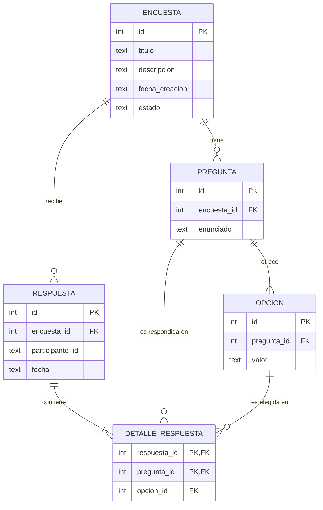
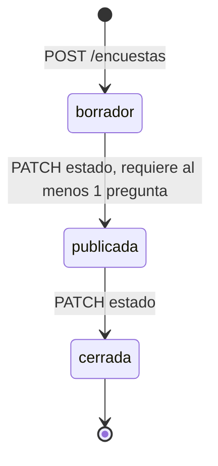

# API de Encuestas

API REST para crear, publicar, responder y analizar encuestas de **respuesta única** (cada participante elige una sola opción por pregunta). Arquitectura MVC sobre Express, con persistencia en un archivo SQLite.

- **Versión de la API:** 1.1.0
- **Formato:** JSON sobre HTTP, todas las rutas bajo `/api/encuestas`
- **Contrato formal:** [`openapi.yaml`](./openapi.yaml) (OpenAPI 3.0.3)

## Contenido

1. [Stack y requisitos](#stack-y-requisitos)
2. [Instalación y ejecución](#instalación-y-ejecución)
3. [Configuración](#configuración)
4. [Estructura del proyecto](#estructura-del-proyecto)
5. [Modelo de datos](#modelo-de-datos)
6. [Ciclo de vida de una encuesta](#ciclo-de-vida-de-una-encuesta)
7. [Referencia de la API](#referencia-de-la-api)
8. [Reglas de validación](#reglas-de-validación)
9. [Manejo de errores](#manejo-de-errores)
10. [Ejemplo de flujo completo](#ejemplo-de-flujo-completo)
11. [Decisiones y limitaciones](#decisiones-y-limitaciones)

---

## Stack y requisitos

| Componente | Detalle |
|---|---|
| Runtime | Node.js (desarrollado y probado con la v22) |
| Módulos | ESM: el `package.json` debe tener `"type": "module"` |
| Framework | Express (probado con la v5) |
| Base de datos | SQLite mediante `better-sqlite3` (API síncrona, sin pool de conexiones) |
| Validación | `zod` |
| Otros | `cors` |

`better-sqlite3` incluye binarios precompilados para las plataformas habituales. Si la instalación intenta compilar y falla, usá una versión LTS de Node o instalá las herramientas de compilación de tu sistema operativo.

## Instalación y ejecución

```bash
npm install express better-sqlite3 cors zod
node app.js
```

El servidor queda en `http://localhost:3000`. Al arrancar, `src/config/db.js` abre (o crea) el archivo de base de datos y ejecuta `database/schema.sql`. Como todas las sentencias usan `IF NOT EXISTS`, arrancar varias veces es seguro.

## Configuración

Se configura con variables de entorno:

| Variable | Por defecto | Descripción |
|---|---|---|
| `PORT` | `3000` | Puerto HTTP |
| `DB_PATH` | `database/encuestas.db` | Ruta del archivo SQLite. Es relativa al directorio desde el que se ejecuta `node`, y la carpeta debe existir (SQLite no la crea) |

```bash
# Linux / macOS
PORT=4000 DB_PATH=database/encuestas.db node app.js

# Windows PowerShell
$env:PORT=4000; node app.js

# Con archivo .env (Node 20.6 o superior)
node --env-file=.env app.js
```

La aplicación no lee `.env` por sí sola; hay que pasarlo con `--env-file` o usar una librería como `dotenv`.

**Archivos generados:** SQLite en modo WAL crea `encuestas.db`, `encuestas.db-wal` y `encuestas.db-shm`. Agregalos al `.gitignore`:

```
*.db
*.db-wal
*.db-shm
```

**Cambios de schema:** no hay migraciones. Si modificás `schema.sql`, `IF NOT EXISTS` no altera tablas ya creadas; en desarrollo, borrá los tres archivos de la base para regenerarla.

## Estructura del proyecto

```
.
├── app.js                          # Arranque: middlewares, rutas y manejo de errores
├── openapi.yaml                    # Contrato de la API
├── database/
│   └── schema.sql                  # Definición de tablas
└── src/
    ├── config/db.js                # Conexión SQLite, pragmas y carga del schema
    ├── routes/encuesta.routes.js   # Mapa de endpoints
    ├── schemas/encuesta.schema.js  # Validación y limpieza de entradas con zod
    ├── controllers/encuesta.controller.js  # Reglas de negocio y respuestas HTTP
    ├── models/encuesta.model.js    # Consultas SQL
    └── middlewares/errorHandler.js # crearError, ruta no encontrada y handler global
```

Responsabilidades: las **rutas** solo enlazan URL con controlador; los **schemas** (zod) validan y limpian la entrada; el **controlador** aplica las reglas de negocio y decide el código HTTP; el **modelo** es el único que conoce SQL. Los errores se lanzan con `throw crearError(status, mensaje)` y los captura el handler global.

## Modelo de datos



Restricciones relevantes, aplicadas por la propia base:

- `encuesta.estado` solo admite `borrador`, `publicada` o `cerrada` (por defecto `borrador`).
- `opcion` tiene `UNIQUE (pregunta_id, valor)`: no hay opciones repetidas en una pregunta.
- `respuesta` tiene `UNIQUE (encuesta_id, participante_id)`: un participante responde una sola vez cada encuesta.
- `detalle_respuesta` tiene clave primaria `(respuesta_id, pregunta_id)`: en una respuesta, cada pregunta recibe una sola opción.
- Las claves foráneas están activas (`PRAGMA foreign_keys = ON`) y usan `ON DELETE CASCADE`: borrar una encuesta elimina sus preguntas, opciones y respuestas; borrar una pregunta elimina sus opciones.
- Las fechas se guardan en UTC con formato ISO 8601 (`2026-10-04T21:38:32Z`).

## Ciclo de vida de una encuesta



Una encuesta nace siempre en `borrador`, y el estado no se puede fijar al crearla. Solo se avanza en el orden `borrador → publicada → cerrada`; no hay retrocesos ni saltos.

Qué se puede hacer en cada estado:

| Operación | borrador | publicada | cerrada |
|---|:---:|:---:|:---:|
| Ver listado, detalle y resultados | ✅ | ✅ | ✅ |
| Modificar título/descripción (`PUT /encuestas/{id}`) | ✅ | ✅ | ✅ |
| Agregar, editar o eliminar preguntas | ✅ | ❌ 409 | ❌ 409 |
| Responder | ❌ 409 | ✅ | ❌ 409 |
| Cambiar estado | → publicada | → cerrada | ❌ 409 |
| Eliminar (`DELETE`) | ✅ si no tiene respuestas | ✅ si no tiene respuestas | ✅ si no tiene respuestas |

## Referencia de la API

**URL base:** `http://localhost:3000/api`

| Método | Ruta | Descripción | Éxito |
|---|---|---|---|
| `GET` | `/encuestas` | Listar encuestas | 200 |
| `POST` | `/encuestas` | Crear encuesta (en borrador) | 201 |
| `GET` | `/encuestas/{id}` | Detalle con preguntas y opciones | 200 |
| `PUT` | `/encuestas/{id}` | Modificar título y descripción | 200 |
| `DELETE` | `/encuestas/{id}` | Eliminar encuesta sin respuestas | 204 |
| `PATCH` | `/encuestas/{id}/estado` | Publicar o cerrar | 200 |
| `POST` | `/encuestas/{id}/preguntas` | Agregar pregunta | 201 |
| `PUT` | `/encuestas/{id}/preguntas/{preguntaId}` | Editar pregunta (enunciado y opciones) | 200 |
| `DELETE` | `/encuestas/{id}/preguntas/{preguntaId}` | Eliminar pregunta | 204 |
| `POST` | `/encuestas/{id}/respuestas` | Registrar las respuestas de un participante | 201 |
| `GET` | `/encuestas/{id}/resultados` | Resultados consolidados | 200 |

Los `id` de ruta deben ser enteros positivos; de lo contrario la respuesta es 400.

### `GET /encuestas`

Devuelve un arreglo ordenado por `id`, con los campos de resumen (sin descripción ni preguntas).

```json
[
  { "id": 1, "titulo": "Satisfaccion del cliente", "estado": "publicada", "fechaCreacion": "2026-10-04T21:38:32Z" }
]
```

### `POST /encuestas`

Cuerpo:

```json
{ "titulo": "Satisfaccion del cliente", "descripcion": "Encuesta trimestral" }
```

`titulo` es obligatorio; `descripcion` es opcional. Respuesta `201` con el detalle:

```json
{
  "id": 1,
  "titulo": "Satisfaccion del cliente",
  "estado": "borrador",
  "fechaCreacion": "2026-10-04T21:38:32Z",
  "descripcion": "Encuesta trimestral",
  "preguntas": []
}
```

Errores: `400` (validación).

### `GET /encuestas/{id}`

Devuelve el mismo formato de detalle, con cada pregunta y sus opciones en orden de creación:

```json
{
  "id": 1,
  "titulo": "Satisfaccion del cliente",
  "estado": "borrador",
  "fechaCreacion": "2026-10-04T21:38:32Z",
  "descripcion": "Encuesta trimestral",
  "preguntas": [
    { "id": 1, "enunciado": "Como calificarias el servicio", "opciones": ["Malo", "Regular", "Bueno", "Excelente"] }
  ]
}
```

Errores: `400` (id inválido), `404`.

### `PUT /encuestas/{id}`

Reemplaza `titulo` y `descripcion` (si se omite `descripcion`, queda en `null`). Mismo cuerpo que el alta. Respuesta `200` con el detalle actualizado. Funciona en cualquier estado, porque no afecta a las preguntas ni a los resultados.

Errores: `400`, `404`.

### `DELETE /encuestas/{id}`

Respuesta `204` sin cuerpo. Elimina también preguntas y opciones. Funciona en cualquier estado, siempre que la encuesta no tenga respuestas registradas.

Errores: `400`, `404`, `409` (ya tiene respuestas).

### `PATCH /encuestas/{id}/estado`

```json
{ "estado": "publicada" }
```

Valores permitidos: `publicada` y `cerrada`. Respuesta `200` con el detalle actualizado.

Errores: `400` (valor no permitido, por ejemplo `borrador`), `404`, `409` (transición inválida, o intento de publicar una encuesta sin preguntas).

### `POST /encuestas/{id}/preguntas`

```json
{ "enunciado": "Como calificarias el servicio", "opciones": ["Malo", "Regular", "Bueno", "Excelente"] }
```

Respuesta `201`:

```json
{ "id": 1, "enunciado": "Como calificarias el servicio", "opciones": ["Malo", "Regular", "Bueno", "Excelente"] }
```

La pregunta y sus opciones se guardan en una transacción: o se crean todas o ninguna.

Errores: `400`, `404`, `409` (la encuesta no está en borrador).

### `PUT /encuestas/{id}/preguntas/{preguntaId}`

Edita una pregunta: **reemplaza** el enunciado y todas las opciones. Mismo cuerpo que el alta:

```json
{ "enunciado": "Como calificarias la atencion", "opciones": ["Mala", "Buena", "Excelente"] }
```

Respuesta `200` con la pregunta actualizada (`{ id, enunciado, opciones }`). Solo se permite en borrador: una vez publicada, hay votos que apuntan a las opciones y cambiarlas falsearía los resultados. Se guarda en una transacción.

Errores: `400`, `404` (la encuesta no existe, o la pregunta no pertenece a ella), `409` (la encuesta no está en borrador).

### `DELETE /encuestas/{id}/preguntas/{preguntaId}`

Respuesta `204` sin cuerpo. Elimina la pregunta y sus opciones.

Errores: `400`, `404` (la encuesta no existe, o la pregunta no pertenece a ella), `409` (la encuesta no está en borrador).

### `POST /encuestas/{id}/respuestas`

Registra las respuestas de un participante a la vez:

```json
{
  "participanteId": "anon-8f3a",
  "respuestas": [
    { "preguntaId": 1, "valor": "Bueno" },
    { "preguntaId": 2, "valor": "Si" }
  ]
}
```

Respuesta `201` **sin cuerpo**. El registro es atómico: si algo falla, no se guarda ninguna respuesta del participante.

Errores: `400` (ver [validación](#reglas-de-validación)), `404`, `409` (la encuesta no está publicada, o el participante ya respondió).

### `GET /encuestas/{id}/resultados`

```json
{
  "encuestaId": 1,
  "totalParticipantes": 2,
  "preguntas": [
    {
      "preguntaId": 1,
      "enunciado": "Como calificarias el servicio",
      "resultados": [
        { "opcion": "Malo", "cantidad": 0, "porcentaje": 0 },
        { "opcion": "Regular", "cantidad": 0, "porcentaje": 0 },
        { "opcion": "Bueno", "cantidad": 1, "porcentaje": 50 },
        { "opcion": "Excelente", "cantidad": 1, "porcentaje": 50 }
      ]
    }
  ]
}
```

- `totalParticipantes` es la cantidad de respuestas registradas para la encuesta.
- `porcentaje` = `cantidad / totalParticipantes × 100`, redondeado a un decimal; vale `0` si todavía no hay participantes.
- Siempre se incluyen todas las opciones, también las que no recibieron votos.
- Está disponible en cualquier estado, también en `borrador` (con ceros).

Errores: `400`, `404`.

## Reglas de validación

| Campo | Regla |
|---|---|
| `id`, `preguntaId` (ruta) | Entero positivo |
| `titulo` | Texto no vacío (se recortan los espacios de los extremos) |
| `descripcion` | Opcional; si se envía, debe ser texto |
| `enunciado` | Texto no vacío |
| `opciones` | Lista de al menos 2 textos no vacíos y sin repetir (tras recortar espacios) |
| `estado` (PATCH) | `publicada` o `cerrada` |
| `participanteId` | Texto no vacío |
| `respuestas` | Lista no vacía de `{ preguntaId, valor }`; `preguntaId` entero y `valor` texto |

Estas reglas se definen con [zod](https://zod.dev) en `src/schemas/encuesta.schema.js`. Además de validar, el schema recorta los espacios y descarta los campos desconocidos del cuerpo.

Reglas adicionales al responder:

- `valor` debe coincidir **exactamente** con una opción de esa pregunta, y la pregunta debe pertenecer a la encuesta (distingue mayúsculas y minúsculas; se recortan los espacios de los extremos).
- Una misma `preguntaId` no puede aparecer dos veces (una sola opción por pregunta).
- No es obligatorio responder todas las preguntas. Si un participante omite alguna, los porcentajes de esa pregunta suman menos de 100, porque el divisor es el total de participantes.

Orden de evaluación: primero el formato de los ids y del cuerpo (400, lo resuelve zod), luego que la encuesta exista (404) y después el estado y los conflictos (409). En `POST /respuestas`, que cada `valor` sea una opción válida de la pregunta (400) se revisa **después** de comprobar el estado de la encuesta y si el participante ya respondió, porque requiere consultar la base.

## Manejo de errores

Todos los errores devuelven JSON con una única clave:

```json
{ "mensaje": "La encuesta con id 999 no fue encontrada." }
```

| Código | Cuándo |
|---|---|
| `400` | Cuerpo o parámetros inválidos, incluido JSON malformado |
| `404` | La encuesta o la pregunta no existen, o la ruta no existe (`"Ruta no encontrada"`) |
| `409` | Conflicto con el estado o las reglas de negocio |
| `500` | Error interno: se registra en la consola del servidor y el cliente recibe un mensaje genérico, sin detalles de SQL |

El texto de `mensaje` es informativo y puede cambiar: los clientes deben decidir según el código HTTP, no según el texto.

Cualquier violación de restricción de SQLite que no haya sido anticipada por una validación se traduce como `409` con el mensaje genérico `"Conflicto con restricciones de la base de datos"`.

## Ejemplo de flujo completo

```bash
BASE=http://localhost:3000/api/encuestas
JSON='Content-Type: application/json'

# 1. Crear la encuesta (queda en borrador)
curl -X POST $BASE -H "$JSON" -d '{"titulo":"Satisfaccion","descripcion":"Trimestral"}'

# 2. Agregar preguntas
curl -X POST $BASE/1/preguntas -H "$JSON" \
  -d '{"enunciado":"Te gusto el servicio?","opciones":["Si","No"]}'
curl -X POST $BASE/1/preguntas -H "$JSON" \
  -d '{"enunciado":"Color favorito","opciones":["Rojo","Azul","Verde"]}'

# 3. Publicar
curl -X PATCH $BASE/1/estado -H "$JSON" -d '{"estado":"publicada"}'

# 4. Responder (un participante por request)
curl -X POST $BASE/1/respuestas -H "$JSON" \
  -d '{"participanteId":"a1","respuestas":[{"preguntaId":1,"valor":"Si"},{"preguntaId":2,"valor":"Azul"}]}'

# 5. Consultar resultados
curl $BASE/1/resultados

# 6. Cerrar la encuesta
curl -X PATCH $BASE/1/estado -H "$JSON" -d '{"estado":"cerrada"}'
```

En Windows PowerShell conviene usar `curl.exe` (o `Invoke-RestMethod`) y escapar las comillas del JSON, o directamente probar con Postman/Insomnia importando `openapi.yaml`.

## Decisiones y limitaciones

- **Solo respuesta única.** No hay preguntas de selección múltiple ni de texto libre: toda pregunta se responde con una sola opción de una lista cerrada.
- **Sin autenticación ni autorización.** Cualquiera con acceso a la API puede crear, modificar, publicar o borrar encuestas. `participanteId` es texto libre: la restricción de "una respuesta por participante" solo detecta el mismo identificador repetido, no impide que alguien invente otros. Es adecuado para uso interno o de clase, no para exponerlo a internet sin una capa de acceso.
- **CORS abierto** (`Access-Control-Allow-Origin: *`) para facilitar el consumo desde un frontend. En producción, restringilo en `app.js` con `cors({ origin: '...' })`.
- **Una sola instancia.** SQLite es un archivo local; no está pensado para varias réplicas del servidor escribiendo a la vez.
- **Sin paginación** en el listado de encuestas.
- **Preguntas y opciones solo se editan en borrador:** una vez publicada la encuesta hay votos que apuntan a las opciones, y cambiarlas falsearía los resultados. El título y la descripción sí se pueden editar siempre.
- **Operaciones síncronas.** `better-sqlite3` bloquea el event loop durante cada consulta; para este volumen de datos las consultas tardan microsegundos.