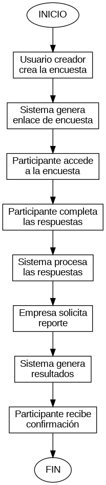
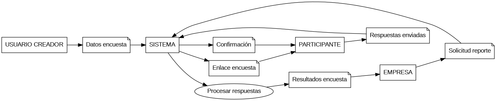
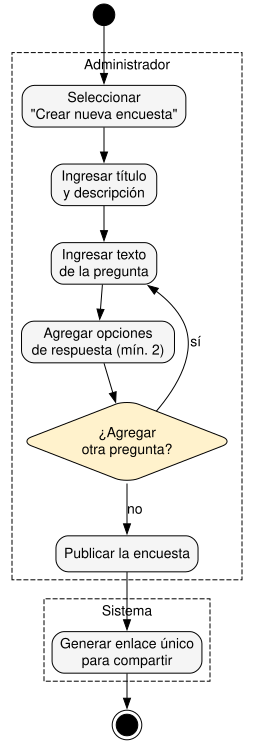
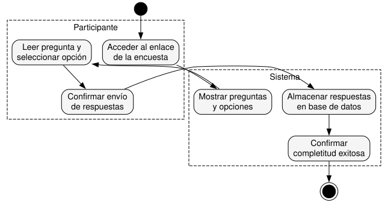
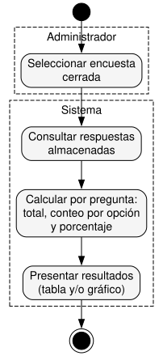

# Diagramas del Sistema

## Diagrama de Flujo

El siguiente diagrama representa el flujo general del sistema de encuestas, desde la creación de una encuesta hasta la generación de los resultados.

Archivo fuente:

[Ver diagrama en Graphviz](diagramas/flujo/flujo.dot)

---

## Diagrama de Flujo de Datos (DFD)

El DFD representa cómo circula la información entre los usuarios y el sistema de encuestas.

El participante envía sus respuestas al sistema, mientras que la empresa solicita y recibe los resultados de las encuestas.

Archivo fuente:

[Ver diagrama en Graphviz](diagramas/dfd/dfd.dot)

---

## Diagrama Entidad-Relación

El siguiente diagrama representa la estructura de datos del sistema de encuestas y las relaciones entre sus entidades.

[Ver código del diagrama Entidad-Relación](diagramas/entidad-relacion/modelo-er.md)
---

## Diagrama de Transición de Estado (Ciclo de Vida de Encuestas)

El siguiente diagrama representa el ciclo de vida de una encuesta, desde su creación hasta su cierre.

[Ver código del diagrama de Transición de Estado](diagramas/transicion-estado/ciclo-vida-encuestas.md)
 --- ## Diagramas de Actividades Los siguientes diagramas representan el flujo paso a paso de los procesos principales del sistema. ### Creación de una encuesta  Archivo fuente: [Ver código en Graphviz](diagramas/actividades/crear-encuesta.dot) ### Participación en una encuesta  Archivo fuente: [Ver código en Graphviz](diagramas/actividades/participar-encuesta.dot) ### Generación de reportes  Archivo fuente: [Ver código en Graphviz](diagramas/actividades/generar-reportes.dot)

